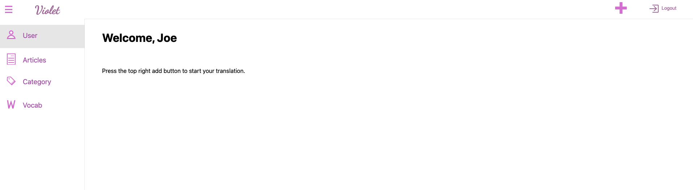
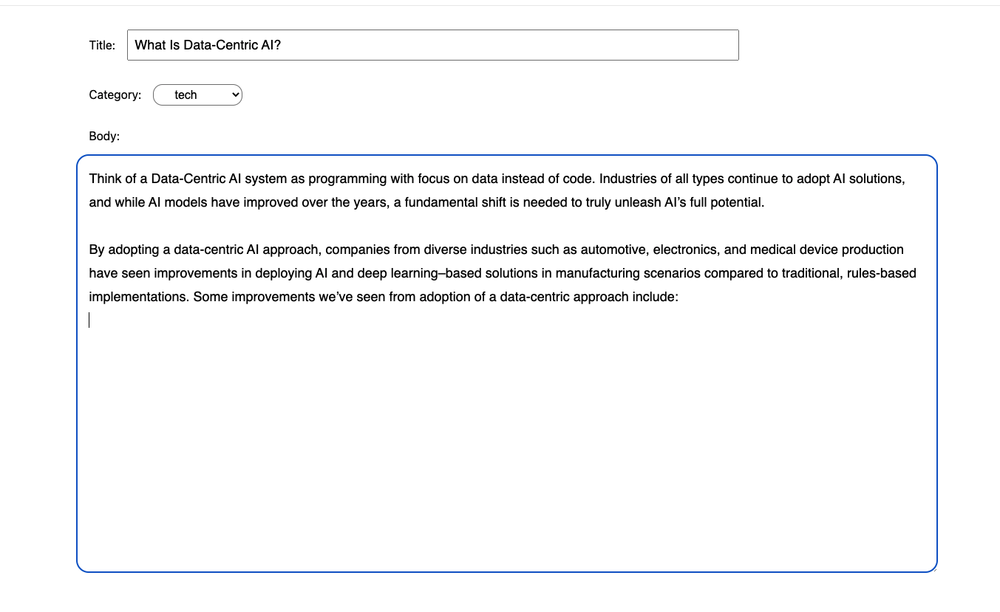
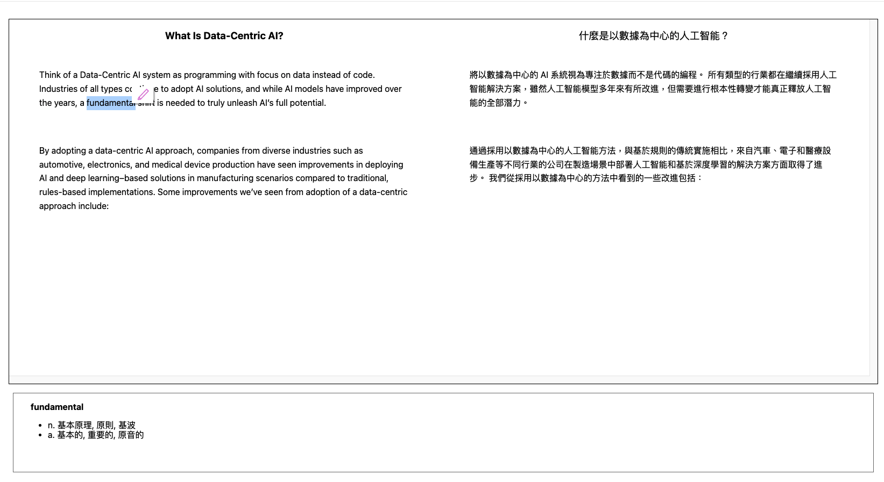
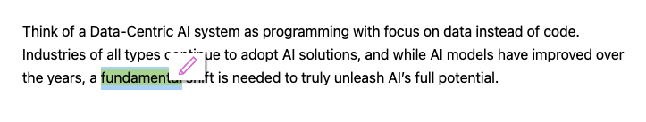
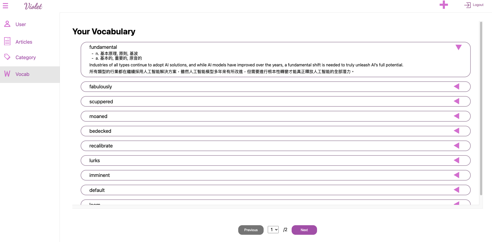

# Violet
This project is for learning purpose. It covers: 
Frontend: Javascript and Vue
Backend: Java, Spring Boot, gRPC for Java

## What this project do
For English learning
### Translate
- translate English article to Chinese
- English to Chinese Dictionary
### Store
- Store your favourite article
- Store your recently learned vocabulary

## Usage Workflow

### 1. find your favourite article and paste it to Violet

### 2. Violet will translate your article into chinese then you can read it.

### 3. You can use your mouse to select any word.
Such as "fundamental" in above image. Violet will use its inbuilt dictionary and show the meaning of your selected word
instantly at the bottom of the website.
### 4. You can see a pen icon pop up, you can use it to highlight any word.
Highlighted words will be added to your vocabulary list.

### 5. Go to your vocabulary
You can see the highlighted word "fundamental" was added here. You can review what you have learnt.

## Design Overview
### Rest API
- the frontend and backend are separated. 
- No JSP or thymeleaf 
### Database
- JPA and Hibernate
- PostgreSQL
### Swagger
- Springfox
### Authentication
- currently Form only 
- session (will switch to stateless in the future)
### Translation
- python handle the language processing logic since python have more library support for this. 
- Setup a gRPC client in Java and gRPC server in Python
- The translation engine is Google Translate Cloud API